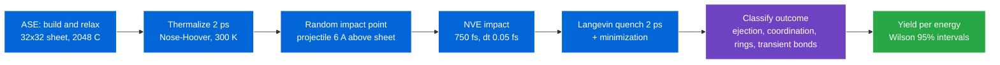
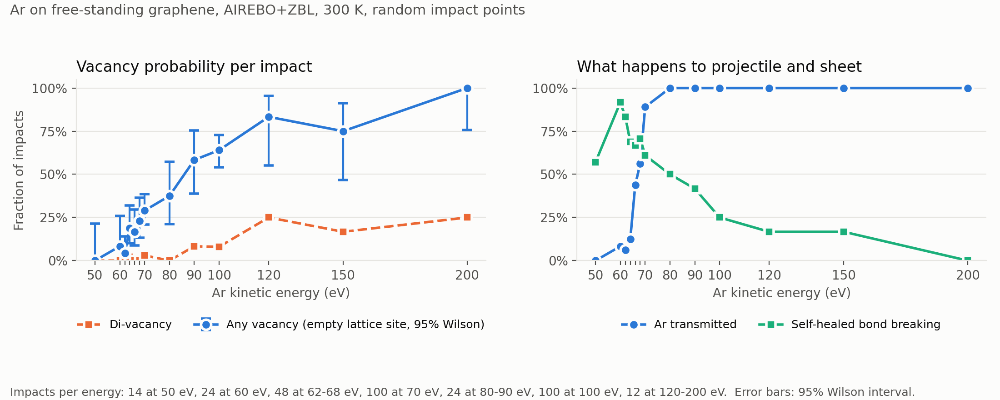
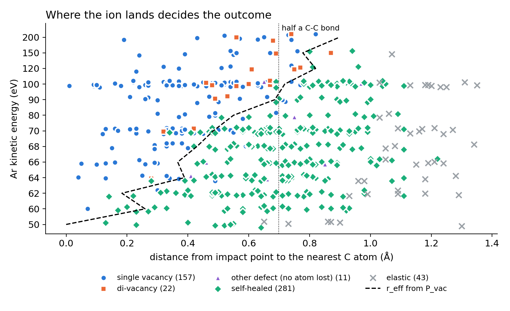
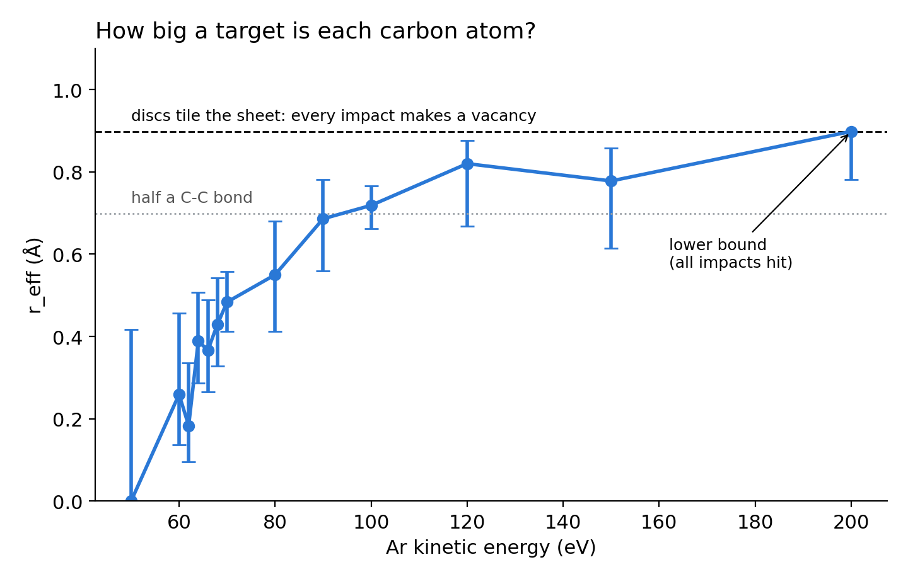
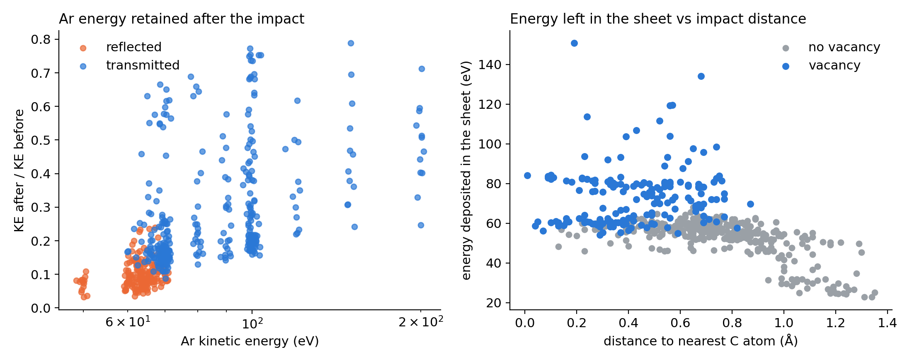
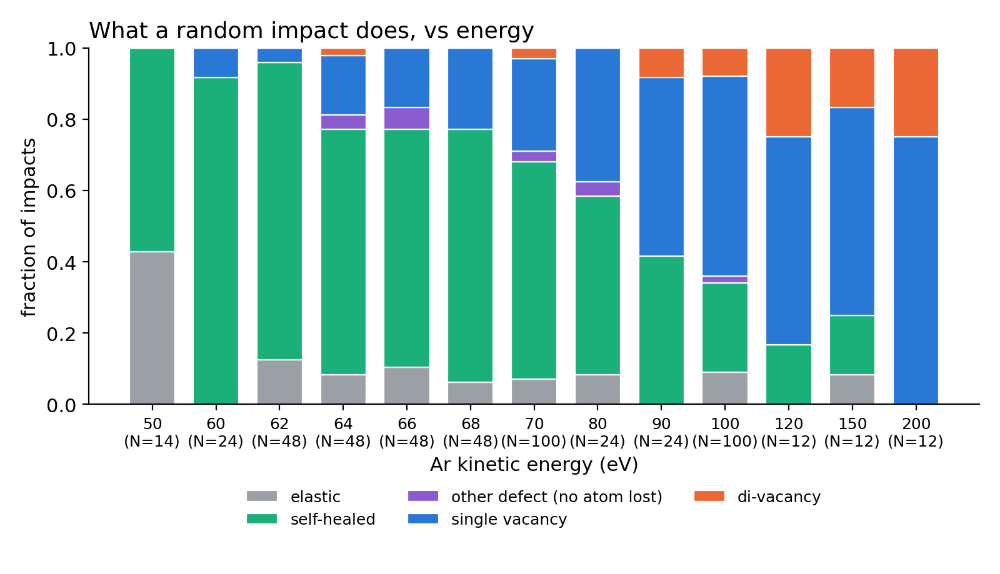
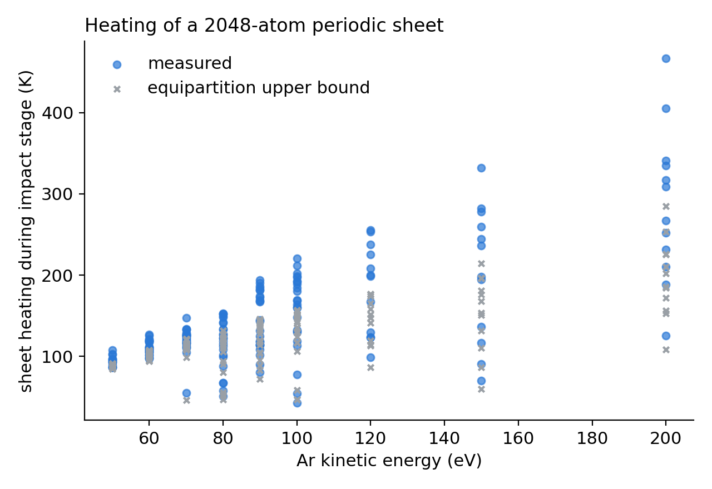
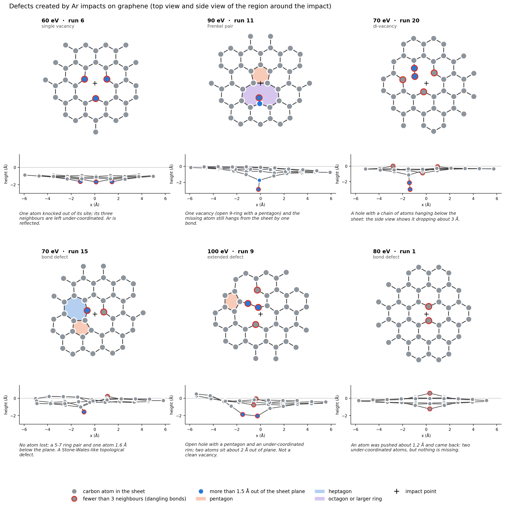

<div align="center">

# 💥 Graphene-Defect-Engineering-MD

**Statistical molecular dynamics of low-energy ion bombardment of graphene**

Ar impacts on a thermalized 2048-atom graphene sheet: vacancy yields, self-healing and projectile fate vs. energy


[](LICENSE)

[Overview](#-overview) · [Method](#-method) · [Results](#-results) · [Convergence](#-convergence-tests) · [Quick start](#-quick-start) · [Structure](#-repository-structure) · [Limitations](#-limitations-and-roadmap) · [License](#-license)

</div>

---

## 📖 Overview

Ar<sup>+</sup> sputtering followed by annealing is a standard way to create vacancies in graphene and graphite surfaces, and I used it experimentally during my Ph.D. (UHV sputtering/annealing, STM). This repository asks the simulation counterpart of that question:

> **At a given ion energy, how often does an impact create a vacancy, and what else can happen?**

A single trajectory cannot answer that, because the outcome depends on *where* the ion lands and on the thermal state of the lattice. The pipeline therefore runs **many independent impacts** per energy on a thermalized sheet, classifies every outcome automatically, and reports **yields with 95% confidence intervals**.

> [!NOTE]
> **Scope.** Laptop-scale study of the workflow and of the physics it captures: 514 independent impacts (up to 100 per energy near 70 and 100 eV), free-standing sheet, classical potential. Protocol convergence (quench time, observation window, sheet size, classification thresholds) is tested in [Convergence tests](#-convergence-tests). The absolute numbers still depend on the Ar–C interaction model; see [Limitations](#-limitations-and-roadmap).

---

## 🔧 Method



| Ingredient | Choice |
|---|---|
| Sheet | 32×32 supercell, 2048 C, periodic in x/y, relaxed with AIREBO (a₀ = 2.419 Å) |
| Potential (Ar–C) | `pair_style hybrid airebo 3.0 zbl 4.0 5.0`: AIREBO for C–C, ZBL for the repulsive Ar–C core |
| Thermal state | sheet thermalized to 300 K before each impact (NVT), projectile not integrated during this stage |
| Impact | projectile 6 Å above the sheet, normal incidence, **random in-plane impact point** (reproducible seeds) |
| Integration | velocity Verlet NVE, 0.05 fs (checked against 0.01 fs: identical outcomes, energy drift < 10⁻³ eV) |
| Relaxation | Langevin quench (2 ps) then conjugate-gradient minimization, so defects are read on a relaxed structure |
| Statistics | N independent impacts per energy; 95% Wilson interval on every probability |

### Outcome classification (`03_analyze_impacts.py`)

For every run the final structure and the full trajectory are analysed. **Vacancies are decided by bonding, not by height**: a local dimple can push a whole group of still-bonded atoms more than 1.5 Å below the sheet, so a height threshold either invents vacancies or misses them.

- **missing atom** = an atom that left the sheet plane (|dz| > 3 Å) or has at most one C neighbour (cutoff 1.85 Å); dangling chains are peeled atom by atom until nothing changes, so a 3-atom chain hanging under a hole counts as missing atoms, not as one,
- **single / di- / multi-vacancy** from the number of missing atoms; **Frenkel pair** = one missing atom whose atom is still bonded to the sheet as an adatom,
- **extended defect** = no atom missing, but an open hole with ≥ 4 under-coordinated atoms,
- **ring statistics** (chordless rings up to size 9) → topological defects such as 5-7 pairs or Stone–Wales (5-5-7-7) with no atom missing; a relaxed single vacancy shows 5-9,
- **transient bond breaking** along the trajectory → *self-healed* pass-through events,
- **projectile fate** → reflected / transmitted / trapped.

A single vacancy always shows 3 under-coordinated neighbours and a di-vacancy 4, which is used as a sanity check on the rule. Defects were also checked by eye on cropped structures (`06_export_defect.py`, `05_inspect_run.py`).

---

## 📊 Results

Ar on free-standing graphene, AIREBO + ZBL, 300 K, random impact points, normal incidence, 514 impacts in total.



| E (eV) | N | P(vacancy) [95% CI] | single | di-vacancy | self-healed | Ar transmitted | C sputtered per ion |
|---:|---:|:---:|:---:|:---:|:---:|:---:|:---:|
| 50 | 14 | 0.00 [0.00–0.21] | 0.00 | 0.00 | 0.57 | 0.00 | 0.00 |
| 60 | 24 | 0.08 [0.02–0.26] | 0.08 | 0.00 | 0.92 | 0.08 | 0.08 |
| 62 | 48 | 0.04 [0.01–0.14] | 0.04 | 0.00 | 0.83 | 0.06 | 0.04 |
| 64 | 48 | 0.19 [0.10–0.32] | 0.17 | 0.02 | 0.69 | 0.12 | 0.21 |
| 66 | 48 | 0.17 [0.09–0.30] | 0.17 | 0.00 | 0.67 | 0.44 | 0.17 |
| 68 | 48 | 0.23 [0.13–0.36] | 0.23 | 0.00 | 0.71 | 0.56 | 0.21 |
| 70 | 100 | 0.29 [0.21–0.39] | 0.26 | 0.03 | 0.61 | 0.89 | 0.28 |
| 80 | 24 | 0.38 [0.21–0.57] | 0.38 | 0.00 | 0.50 | 1.00 | 0.38 |
| 90 | 24 | 0.58 [0.39–0.76] | 0.50 | 0.08 | 0.42 | 1.00 | 0.62 |
| 100 | 100 | 0.64 [0.54–0.73] | 0.56 | 0.08 | 0.25 | 1.00 | 0.71 |
| 120 | 12 | 0.83 [0.55–0.95] | 0.58 | 0.25 | 0.17 | 1.00 | 1.08 |
| 150 | 12 | 0.75 [0.47–0.91] | 0.58 | 0.17 | 0.17 | 1.00 | 0.92 |
| 200 | 12 | 1.00 [0.76–1.00] | 0.75 | 0.25 | 0.00 | 1.00 | 1.25 |

*P(vacancy)* is the probability that at least one lattice site is empty after relaxation (see classification above). *single* includes the Frenkel pairs. The last column is the sputtering yield (mean number of C atoms ejected per ion). Rows with N = 12–24 have wide intervals; the 120–150 eV non-monotonicity is within them.

### Physics

- **A threshold region near 63 ± 2 eV, then a slow rise.** No vacancy at 50 eV, 4% at 62 eV, 19% at 64 eV, a plateau of 17–23% over 64–68 eV, 29% at 70 eV and 64% at 100 eV. The maximum energy an Ar atom can transfer to a carbon atom head-on is 0.71 E, so 63 eV corresponds to about 45 eV transferred, roughly twice the ≈22 eV carbon displacement threshold quoted for pristine graphene in atomistic simulations (Åhlgren et al., arXiv:1205.1826, who simulated He, Ar and Xe ions on graphene). The two numbers are not directly comparable: the threshold is defined for a carbon atom that receives the energy directly, whereas here the impact points are random (many are far from an atom), the ion can be reflected or transmitted, and the sheet is at 300 K, so treat the factor as a reminder that the onset is not a simple head-on threshold.
- **The vacancy probability is a cross-section.** Each carbon atom owns 2.53 Ų of sheet. The effective radius r_eff = √(P·A_atom/π) is 0.26 Å at 60 eV, 0.48 Å at 70 eV, 0.72 Å at 100 eV (half a C–C bond is 0.70 Å) and ≥ 0.9 Å at 200 eV, where every impact makes a vacancy. At 70 eV all single vacancies come from impacts within 0.5 Å of an atom; impacts more than 1 Å from any atom (over the hexagon centre) leave the sheet elastic.
- **Ar transmission switches on faster than vacancy creation.** The fraction of Ar atoms crossing the sheet goes from 6% at 62 eV to 56% at 68 eV and 89% at 70 eV, while P(vacancy) only goes from 4% to 23% and 29%. The two are correlated, but the ion can cross the lattice with no permanent damage.
- **Self-healing dominates near the threshold.** Between 50 and 90 eV more than half of the impacts break bonds transiently while the ion passes and the lattice then re-forms with no defect (92% at 60 eV, 61% at 70 eV, 25% at 100 eV, 0% at 200 eV).
- **Di-vacancies** appear from 64 eV (2%, then 3% at 70 eV) and reach 17–25% above 120 eV (N = 12 there); no multi-vacancy up to 200 eV.
- **Sputtering yield** is 0.28 C per ion at 70 eV, 0.71 at 100 eV and about 1.2 at 200 eV. Mean energy left in the sheet is 58 eV of 70 eV and 68 eV of 100 eV, but it varies a lot between runs (the ratio has a standard deviation of 0.11 at 70 eV); this overstates what the lattice absorbs because it includes the kinetic energy of ejected atoms.
- **Sheet heating.** The impact stage is microcanonical: the 2048-atom sheet warms by about 120 K at 70 eV and 156 K at 100 eV (on average slightly above E_dep/3Nk_B, with a large spread and some runs well above it, see below), and by 53 K and 70 K on a 4608-atom sheet, as expected for the larger heat sink.
- **Rarer outcomes.** Frenkel pairs (vacancy plus an atom hanging by one bond), an extended defect with an open hole and 5-ring (100 eV), 5-7 and 3-5 topological defects with no atom lost (70 eV), and bond defects with no missing atom.



*Where the ion lands decides the outcome: distance from the impact point to the nearest C atom against energy. The dashed line is r_eff from P(vacancy).*



*Effective vacancy radius r_eff = √(P·A_atom/π) against energy, with the 95% interval. The 200 eV point is a lower bound because every impact made a vacancy.*

### Energy transfer, outcome composition, heating and defects



*Left: kinetic energy of the Ar atom after the impact divided by its energy before (log energy axis). Right: energy left in the sheet against the distance from the impact point to the nearest C atom, coloured by whether a vacancy formed.*

- **Reflected and transmitted Ar lose most of their energy.** Reflected ions (50–70 eV) leave with only 5–15% of their initial energy. Transmitted ions keep typically 15–35% at 70–100 eV, and up to about 80% in a few high-energy runs, so the sheet takes the larger part of the energy in nearly every impact. The retained fraction rises with energy, with a large scatter at a given energy that reflects the impact point.
- **Vacancies need more than about 55 eV in the sheet, but the deposited energy and the impact point do not fully decide.** Every vacancy sits at 55 eV or more and within about 0.9 Å of an atom; impacts farther away, and those that leave less than about 55 eV, give none. Between roughly 55 and 70 eV, however, both outcomes occur at similar distances, so the thermal displacement of the lattice atoms at the moment of impact presumably matters as well. The deposited energy includes the kinetic energy carried off by ejected atoms, so it is an upper estimate of what the lattice absorbs.



*Fraction of impacts per outcome class against Ar energy (N under each bar). Single vacancy includes Frenkel pairs; "other defect" is a topological or extended defect with no atom lost.*

The stacked bars show the same trend as the yield table in one picture. Elastic outcomes are the largest single class only at 50 eV (43%) but persist at 6–12% at most energies up to 150 eV (impacts far from any atom), self-healing is the largest class up to 80 eV, single vacancies take over from 90 eV, and di-vacancies appear from 64 eV (2%) and reach 25% at 200 eV. Rare "other defect" outcomes (2–6% between 64 and 100 eV) are the 5-7 and extended defects with no atom lost. At 120 eV and above each bar has N = 12, so a single impact is 8%: those bars show the trend, not precise fractions.



*Temperature rise of the 2048-atom periodic sheet during the impact stage (measured) against the equipartition estimate E_dep/3Nk_B (crosses), for every impact.*

The heating grows with the energy left in the sheet and is of the order of 100 K at 70–100 eV, 250 K at 200 eV. The estimate assumes the energy is shared equally between kinetic and potential energy. Many measured values lie above it, up to about 1.6 times at 200 eV, because the temperature is read at the end of the impact stage, before the energy has equipartitioned and while part of it is still kinetic. The estimate is therefore a guide to the scale, not an upper bound. The weak heating of the 4608-atom sheet (53 K and 70 K at 70 and 100 eV) confirms that the rise is set by the size of the heat sink.



*Top and side views of the region around the impact for representative runs (`09_defect_gallery.py`). A run can be inspected with `05_inspect_run.py` using its tag, for example `Ar_random_E90_run11`.*

The gallery shows the outcomes classified in the previous sections: a single vacancy at 60 eV (run 6, the ion is reflected and three neighbours are left under-coordinated), a Frenkel pair at 90 eV (run 11, a 9-ring with a pentagon and the missing atom still hanging by one bond), a di-vacancy with a chain of atoms hanging more than 3 Å below the sheet at 70 eV (run 20), a Stone–Wales-like 5-7 ring pair with one atom 1.6 Å below the plane and no atom lost at 70 eV (run 15), an extended defect at 100 eV (run 9: an open hole with a pentagon and two atoms about 2 Å out of plane, not a clean vacancy), and an atom pushed 1.2 Å out of plane that came back, leaving two under-coordinated atoms and nothing missing at 80 eV (run 1). The side views show that many defects are accompanied by large out-of-plane displacements, which is why vacancies are decided by bonding and not by height.

---

## ✅ Convergence tests

The quench, window and threshold tests reuse the same random seeds as the baseline, so runs are compared one by one (paired), not only on average.

| Test | Baseline → changed | Result |
|---|---|---|
| Quench time | 2 ps → 5 ps (24 runs, 70 and 100 eV) | all 24 runs keep their outcome class; P(vac) identical |
| Observation window | 750 fs → 1500 fs (24 runs) | all 24 runs keep their outcome class; reflected Ar is already ~70 Å away, so the periodic return wave plays no role |
| Sheet size | 2048 → 4608 atoms (24 runs per energy) | P(vac) 0.33 → 0.42 at 70 eV, 0.71 → 0.79 at 100 eV: intervals overlap, shift is not significant; sheet heating falls by 2.2× |
| Statistics | N = 24 → 48 → 100 at 70 eV | P(vac) 0.33 → 0.31 → 0.28; 100 eV: 0.71 → 0.67 → 0.64 |
| Classification thresholds | ejection height 2.5–3.5 Å; C–C cutoff 1.75–1.95 Å (514 runs) | vacancy yes/no changes in at most 1 of 514 runs; no single/di-vacancy label changes |

The size test is not paired (different geometry). Its shift is within the intervals but has the same sign at both energies, so a larger sample on the big sheet would be needed to exclude a finite-size effect of about 0.1 in P(vac).

---

## 🚀 Quick start

```bash
# environment
conda install -c conda-forge lammps ase numpy
# potential: copy CH.airebo from the LAMMPS distribution (potentials/) into the working directory

# 1. relax the support
python 01_relax_support.py

# 2. statistical bombardment: 24 random impacts per energy, 10 single-core runs at once
python 02_defect_engineering_stats.py --projectiles Ar \
       --energies 60 70 80 90 100 --impacts 24 --parallel 10   # 2048 atoms, 24 impacts each

# 3. classify outcomes and build the yield table
python 03_analyze_impacts.py --jobs 7      # parallel and cached; --reanalyse to redo all

# 4. plot the yield curve (reads yield_summary.csv)
python 04_plot_yield.py

# 5. physics figures: outcome map, cross-section, composition, energy loss, heating, gallery
python 07_plot_physics.py
python 08_energy_loss.py
python 10_sheet_heating.py
python 09_defect_gallery.py

# 6. look at a defect (run tag as in the analysis table)
python 05_inspect_run.py Ar_random_E90_run11
python 06_export_defect.py Ar_random_E90_run11 --radius 8   # extxyz for ase gui / OVITO

# 7. convergence campaign (about 12 h on 16 cores): quench, window, 4608-atom sheet, N = 100, onset grid
nohup env PAR=16 bash run_overnight.sh > overnight.log 2>&1 &
python 11_compare_runs.py impact_analysis.csv conv_quench5/impact_analysis.csv --paired
```

The run is resumable: asking for more impacts (`--impacts 24`) keeps finished runs and adds the new ones, because the run number is part of the random seed. Useful options: `--temperature`, `--timestep`, `--time-fs`, `--seed`, `--a0`, `--dry-run`. `--force` redoes finished impacts.

Running independent single-core jobs is faster than MPI on one 2048-atom sheet (MPI communication dominates), so `--parallel` is the recommended way to use a many-core machine.

---

## 📁 Repository structure

```
├── 01_relax_support.py            # build and relax the graphene sheet (ASE + LAMMPS)
├── 02_defect_engineering_stats.py # thermalize, random impacts, quench, minimize
├── 03_analyze_impacts.py          # classification, ring analysis, yield table
├── 04_plot_yield.py               # yield curve with Wilson intervals
├── 05_inspect_run.py              # list the atoms behind a classification
├── 06_export_defect.py            # crop a defect for ase gui / OVITO
├── 07_plot_physics.py             # outcome map, effective radius, outcome composition
├── 08_energy_loss.py              # energy left in the sheet from the Ar kinetic energy
├── 09_defect_gallery.py           # top and side views of representative defects
├── 10_sheet_heating.py            # sheet temperature rise in the impact stage
├── 11_compare_runs.py             # paired comparison of two analyses (convergence tests)
├── run_overnight.sh               # convergence campaign
├── figures/                       # yield_curve, outcome_map, cross_section, gallery, ...
├── convergence/                   # tables of the convergence tests (quench, window, 4608 atoms, thresholds)
├── yield_summary.csv              # yield table per energy
├── impact_analysis.csv            # one row per impact (514 runs)
├── energy_loss.csv · heating.csv  # energy left in the sheet, sheet temperature rise
└── LICENSE
```

---

## ⚠️ Limitations and roadmap

- **Free-standing sheet.** Experiments use a substrate that absorbs momentum and changes thresholds and reflection.
- **Classical nuclei, no electronic excitation.** ZBL is a screened-Coulomb core, not a fitted Ar–C potential.
- **Sample size.** 12–24 impacts per energy away from 70 and 100 eV give wide intervals (±0.2 at N = 24); the 60–70 eV onset and the trend are solid, individual points above 100 eV and the di-vacancy fractions are not. The finite-size shift between 2048 and 4608 atoms (about 0.1 in P(vac)) is not resolved with 24 runs.
- **Observation window.** The sheet is read after a 750 fs impact stage, a 2 ps quench and a minimization; slower defect evolution (annealing, bond rotations) is outside this protocol.
- **Normal incidence only.**
- **N projectiles are not production-ready.** The ReaxFF set available here (`ffield.reax.CHN`, a nitramine parametrization) does not describe graphene well (vacancy formation energy 3.6 eV against 7.65 eV with AIREBO), so N bombardment needs a validated potential. The plan is to train a **MACE** potential on DFT data for C–N (including high-energy repulsive configurations).

A follow-up project (in preparation) checks the AIREBO defect energetics against DFT (GPAW, PBE) and repeats paired impacts with a fine-tuned MACE potential, so the numbers above serve as the classical baseline.

Planned: more impacts above 100 eV (intervals shrink as 1/√N), a larger sheet at N = 100, a second interatomic potential as a model check, DFT relaxation of the MD defects, oblique incidence, substrate model, N doping with a validated potential.

---

## 📄 License

Released under the [MIT License](LICENSE). Copyright © 2026 Safouan Ziat.

---

## 👤 Author

**Safouan Ziat**, Ph.D. · computational materials science · [GitHub](https://github.com/safouanziat)
